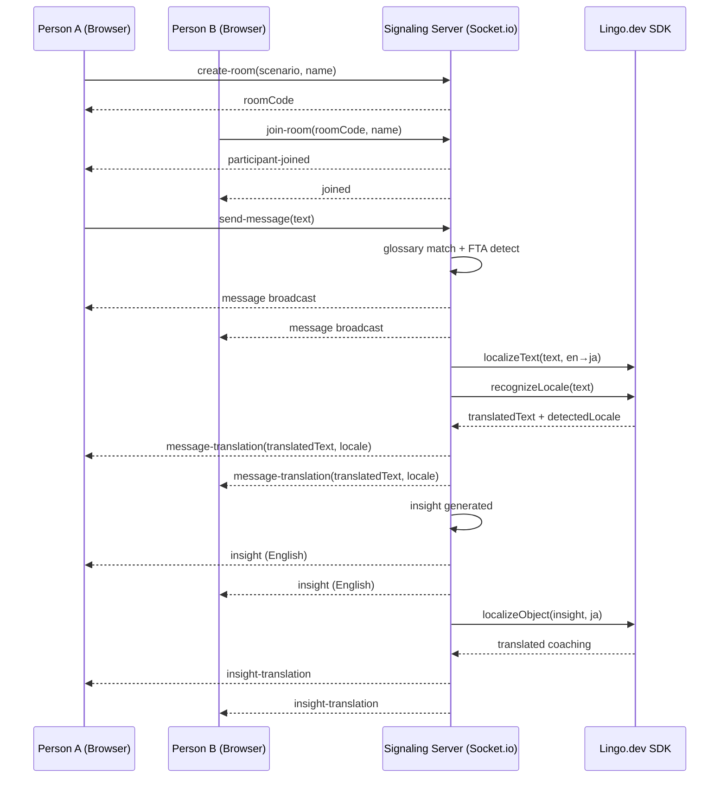

# How a Missed "Yes" Cost Us $500K—And Why We Built CultureCall

**The moment I learned that some conversations fail in plain sight.**

Last year, I was working on Microsoft's global sales operations team. My job was straightforward: help regional reps close deals faster across 15+ countries.

One Tuesday afternoon, my manager walked into my office with a thick file. A Tokyo-based fintech prospect—$500K+ contract, nine months of lead time, perfect product fit—had just evaporated.

I grabbed the call transcript. Read it top to bottom. Nothing screamed disaster. Both sides were polite. Professional. The prospect's message: *"This is very interesting. We'll discuss internally and get back to you."*

Sarah (our rep) felt good. She'd sent a follow-up confident they'd hear back in a week.

By Friday: silence.

By month-end: ghosted.

Three months later, the prospect told us through a mutual contact: *"Great product, not right for our timeline."* They'd meant "no" the entire time.

"This is very interesting" in Tokyo business culture? It's basically a polite brush-off. In the US (where Sarah trained), "interesting" is the beginning of a conversation. You're supposed to keep pushing.

So Sarah did. And with every push, she made it *less* likely they'd ever come back.

$500K, gone. Not because the product was bad. Not because Sarah was a bad rep. Because no one in that room understood what the other person actually *meant*.

---

## I Started Digging. And Found This Everywhere.

I spent the next month analyzing our lost-deal data. Three patterns jumped out immediately.

**Pattern 1: The Tokyo Trap**
US sales reps losing deals in Japan, Korea, and China because they were misreading politeness for interest. This happened *at least a dozen times a year* in just our APAC region.

**Pattern 2: Hiring Disasters**
Our Rio de Janeiro recruiting manager kept passing on Brazilian candidates because they led with stories and context-building before jumping to the point. To her, that was rambling. To them, that was building credibility and trust. We'd rejected three genuinely strong hires on that mismatch alone. Later, those candidates killed it at competing companies.

**Pattern 3: The Engineering / PM Standoff**
One of Germany's best engineers sent a brutally direct email pointing out gaps in a product spec. Blunt. Data-driven. Zero softening language. Our Seattle PM read it as a personal attack. The engineer was just being thorough—precision is how German teams build trust.

Two weeks of awkward silence. A quarter's worth of project momentum, lost.

I realized something: **the problem wasn't bad people. The problem was that no one had a way to decode the other person's communication *style* in real time.**

The transcript looked fine. The relationship was already damaged.

---

## Here's the Thing About "Translation"

My team was already using translation tools. Everything on the calls was technically in English. But translation is dumb—it just converts words.

What we needed was *interpretation*. A co-pilot that could sit in that call and whisper: *"Hey, heads up—'interesting' means something different here. You're about to push too hard."*

By the time anyone noticed the miscommunication, it was too late. The trust was already gone.

---

## So We Built CultureCall (Powered by Lingo.dev)

The idea was simple: **real-time cultural intelligence for the conversations that actually matter.**

We started with a key insight: instead of betting everything on a single LLM, we'd build on top of **Lingo.dev**—a version-controlled, auditable cultural glossary platform. Think of it like managing your codebase, but for cultural knowledge.

Every cultural rule, every pattern, every face-threatening phrase gets encoded in Lingo.dev as structured data. This gives us:
- **Transparency**: You can see *exactly* which cultural patterns we're detecting
- **Reliability**: No black-box LLM guessing. Rules are deterministic and fast (<1ms)
- **Debuggability**: When CultureCall flags something, you can audit why in the glossary

On top of that foundation, CultureCall is a practical co-pilot that:

1. Watches the live conversation flow
2. Matches messages against Lingo.dev's cultural glossaries (fast rules)
3. Detects risky moments—mismatched communication styles, face-threatening language, soft "no" patterns
4. *Optionally* escalates to LLM reasoning when rules aren't enough
5. Surfaces insights *while there's still time to adjust*
6. Gives you a measurable health score on alignment

Think of it less as "AI anthropology" and more as "your conversation just got a skilled interpreter in the room—who has a notebook (Lingo.dev) they consulted before speaking."

---

## What We're Actually Solving (Not the Fluff)

### For Sales Teams
Reps misread soft rejections and keep pushing when they should back off. CultureCall catches those moments:
- "Interesting" = not a yes
- "Let me check with the team" = they need consensus, stop asking for individual decisions
- Silence after your ask = you pushed too hard, now they're saving face by avoiding you

### For Recruiting Teams
Hiring managers penalize candidates for communication *style* not *competence*. Brazilian candidates who build rapport first? Not rambling—building trust. Candidates who ask clarifying questions in detail? Not being difficult—showing thoroughness.

CultureCall helps you separate "different communication culture" from "not a fit."

### For Product/Engineering
German engineers are precise. Japanese colleagues are careful about public disagreement. Brazilian teams are relationship-first. American teams are task-first.

When these styles collide in meetings, people assume negativity. CultureCall helps teammates read each other accurately.

---

## How It Actually Works

```mermaid
flowchart TB
  subgraph Lingo[Lingo.dev]
    CLI[Lingo.dev CLI\nVersion-controlled cultural glossaries]
    SDK[Lingo.dev SDK\nlocalizeText \u2022 recognizeLocale\nlocalizeObject \u2022 localizeChat]
    MCP[Lingo.dev MCP Server\nAI-assisted i18n in IDE]
  end

  subgraph Backend[Backend: Node.js + Socket.io]
    Rooms[Room management\n(create/join/participants)]
    Match[Rule-based glossary matcher\n(<1ms)]
    FTA[Politeness/FTA detector\n(pattern-based)]
    Groq[Groq LLM\n(optional deeper analysis)]
    Trans[Live Translation Engine\nlocalizeText + recognizeLocale]
    InsightTrans[Insight Localizer\nlocalizeObject per participant]
  end

  subgraph Frontend[Frontend: Next.js + React]
    Chat[Live chat UI\n2-person rooms]
    Insights[Insight cards\n(severity-coded + bilingual)]
    Health[Conversation Health Score\n(live)]
    Brief[Pre-call Cultural Briefing\n(modal)]
    Gloss[Glossary Viewer\n(per scenario)]
    DNA[Linguistic DNA Report\n(post-call + live preview)]
    Locale[Locale Switcher\n(5 languages via SDK)]
  end

  CLI --> Backend
  MCP --> Lingo
  Rooms --> Chat
  Chat --> Match
  Chat --> FTA
  Chat --> Trans
  Trans -->|translatedText + detectedLocale| Chat
  Match --> Insights
  FTA --> Insights
  Groq --> Insights
  Match --> InsightTrans
  FTA --> InsightTrans
  InsightTrans -->|localized coaching| Insights
  SDK --> Frontend
  SDK --> Trans
  SDK --> InsightTrans
  Insights --> Health
  Insights --> DNA
  Brief --> Chat
  Gloss --> Chat
  Locale --> Frontend
```

Here's the philosophy:

- **Lingo.dev as the knowledge engine**: Version-controlled cultural glossaries (just like code repos). Every cultural rule is auditable, debuggable, and team-maintainable.
- **Lingo.dev as the translation engine**: `localizeText()` for live message translation, `recognizeLocale()` for language detection, `localizeObject()` for insight localization, `localizeChat()` for bilingual reports. Six SDK methods working together.
- **Lingo.dev MCP for developers**: AI coding assistants get structured i18n knowledge through the MCP server—no more hallucinated API patterns when extending the app.
- **Fast rules first** (glossary matching): You get instant wins on known patterns from Lingo.dev. Sub-1ms response time.
- **Tone detection** (politeness analyzer): You catch risky moments that aren't in any glossary. *"Just give me a yes or no"* is face-threatening in most cultures, even if it's not a specific phrase.
- **Optional LLM layer** (Groq): If Lingo.dev rules don't cover something, Groq can reason deeper. If not, you still got value from the rules alone.
- **Real-time and testable**: Messages go in. Glossary matches. Translations come back. Insights come out. Health scores update. You can measure what's working.

---

## The Message Pipeline (What Actually Happens)

```mermaid
flowchart LR
  M[New message text] --> N[Normalize\n(lowercase, trim)]
  N --> G[Glossary match\nfast rules]
  N --> P[Politeness / FTA patterns\nface-threat detection]
  N --> T[Lingo SDK\nrecognizeLocale\ndetect language]
  N --> TR[Lingo SDK\nlocalizeText\ntranslate for other party]
  G -->|0..n hits| I[Insights list]
  P -->|0..n hits| I
  I --> IL[Lingo SDK\nlocalizeObject\ntranslate coaching text]
  IL --> UI[Emit via Socket.io\nRender in UI]
  T -->|detectedLocale badge| UI
  TR -->|translatedText subtitle| UI
  N --> L{Need deeper reasoning?}
  L -->|Optional| Q[Groq LLM analysis\n(cultural reasoning)]
  Q --> I
  UI --> H[Update Health Score]
  UI --> D[Update Linguistic DNA]
```

No LLM dependencies. No single point of failure. Rules do the heavy lifting. LLM is a bonus when you want it. Translation happens asynchronously—zero latency impact on the main message flow.

---

## The Live Chat Flow (For Testing)



Once you can stream messages + insights + translations in real time, everything else is just swapping the message source: live chat, call captions, Zoom transcript, meeting notes.

---

## Three Real Scenarios We're Testing

Not made-up demos. These are the three collaboration patterns that actually cost companies money:

### Scenario 1: US Sales Rep ↔ Tokyo Prospect (EN↔JA)
- **The risk:** Misreading politeness for interest, pushing when they're already leaning no
- **What we catch:** Indirect rejection signals, consensus-before-commitment patterns, formal vs. informal mismatches
- **Real impact:** Prevents wasted follow-ups, saves rep time, preserves relationship for future

### Scenario 2: US Interviewer ↔ Brazilian Candidate (EN↔PT-BR)
- **The risk:** Rating communication style as competence, rejecting someone great because they don't interview like an American
- **What we catch:** Warmth-first rapport building (not rambling), relationship-based credibility, story-driven explanations
- **Real impact:** Reduces false negatives, lets strong candidates show actual skill

### Scenario 3: US Product Manager ↔ German Engineer (EN↔DE)
- **The risk:** Misreading precision and directness as negativity or resistance
- **What we catch:** Data-first communication, honest critique as trust-building, agenda-focused decision-making
- **Real impact:** Prevents escalation, speeds up decisions, improves PM-Eng relationships

---

## Five Features You Actually Use

### Feature 1: Pre-Call Briefing (Prevention)
Before the conversation starts, you get a scenario-specific heads-up:
- What to watch for in *this* specific dynamic
- One or two mistakes to avoid
- How to start on the right foot

30 seconds. It changes your first message. In global calls, that first message sets everything that comes after.

### Feature 2: Live Conversation Health Score
While you're talking, you see a live "wellness check" for the conversation:
- Trust level
- Communication fit
- Engagement
- Overall risk trend

You can see in real time: are we drifting toward miscommunication, or are we aligned?

### Feature 3: Politeness Analyzer (Face-Threat Detection)
Sometimes the risky moment isn't a cultural phrase—it's embedded in *how* you're saying something:

- "I need a decision by Friday" = time pressure (feels demanding in many cultures)
- "Just give me a yes or no" = forcing a binary (face-threatening in consensus cultures)
- "This is basic—why is it taking so long?" = implied criticism (burns trust everywhere)

CultureCall flags these. Suggests safer framing.

### Feature 4: Glossary Viewer (Powered by Lingo.dev)
We made the cultural knowledge base visible. The Glossary tab shows key terms from **Lingo.dev**—the version-controlled repository of cultural patterns:

- Japan: *nemawashi* (building consensus before announcing), *keigo* (formal speech), *tatemae/honne* (public/private face)
- Brazil: *jeitinho* (creative problem-solving), *simpatia* (warmth and relationship preference)
- Germany: *sachlichkeit* (objective matter-of-fact), *gründlichkeit* (thoroughness)

This is radical transparency: you can see the exact glossary entries that triggered insights on your calls. No black box. You can even propose updates to improve the knowledge base over time—just like open-source software.

### Feature 5: Linguistic DNA Report
After the call, you get a profile of how *you* communicated:
- Formality level (how formal vs. casual)
- Directness (how blunt vs. indirect)  
- Face-saving tendency (how much you soften messages)
- Talk patterns (how long your messages are, who's talking more)

Then you see how that matches the *target* for that scenario. Where you're strong. Where you have gaps. Coaching from that gets real fast.

### Feature 6: Live Message Translation (Powered by Lingo.dev SDK)
Every chat message is automatically translated for the other participant using `localizeText()`. A Japanese prospect's message gets an English translation shown as a subtle `🌐` subtitle below the bubble, and vice versa. The original stays primary—translation is supplemental.

Plus, `recognizeLocale()` detects the actual language of every incoming message. A detected locale badge (`[ja]`, `[de]`, `[pt-BR]`) appears next to the sender name. This validates the scenario config and catches code-switching.

And the coaching insights? They're no longer English-only. `localizeObject()` translates the observation, cultural framework, and suggested response into the prospect's language. A Japanese prospect sees coaching like *"直接的な期限プレッシャーは自律性を脅かします"* alongside the English original.

### Feature 7: Bilingual PDF Reports (Powered by Lingo.dev SDK)
When generating the post-call PDF report, the full chat transcript is sent through `localizeChat()` to produce a side-by-side bilingual view. Both parties can review the entire conversation in their language. No more one-sided post-mortems.

---

## Why This Actually Works

Most conversation AI tools bet everything on language models. CultureCall doesn't.

The secret is **Lingo.dev**—how we encode and maintain cultural knowledge:

- **Deterministic rules** (from Lingo.dev glossaries) handle 80% of the work. Fast. Reliable. No API calls. No quota limits.
- **LLM is optional**. If it's overkill, you still got the insights from the rules alone.
- **Live translation** is built in. `localizeText()` translates every message for the other participant. `recognizeLocale()` detects the language. No separate translation layer needed.
- **Coaching is localized**. Insights appear in both English and the participant's language via `localizeObject()`—so a Japanese prospect actually understands the coaching, not just the English speaker.
- **Knowledge base is transparent**. You can audit exactly which glossary entries triggered your insights. Update them. Contribute back.
- **Metrics are built on auditable data**. Health score, DNA report—all measurable, not LLM guesswork.
- **Developer experience**. Lingo.dev MCP Server gives AI coding assistants structured i18n knowledge, so extending the app is faster.

That's a product moat you can actually defend and evolve.

---

## Try It Yourself

### Start the backend
```powershell
cd apps/signaling
npm run dev
```

### Start the frontend
```powershell
cd apps/web
npm run dev
```

### Check the backend is healthy
```powershell
Invoke-RestMethod http://localhost:3001/health | ConvertTo-Json
```

Then open:
- `http://localhost:3000` (landing page)
- `http://localhost:3000/chat` (create a room, invite a friend, test it)

---

## The Math on What This Saves

Let me be concrete. Not guessing, just math.

### Sales Teams (The Tokyo Problem)
**Assumption:** Your company does 200 enterprise sales calls per year with international prospects.

**Current:** 5-10% of deals die silently from miscommunication. Let's say 8 deals a year.
- Avg deal size: $500K
- Lost revenue: $4M per year

**With CultureCall:** Even a 1-2% reduction in miscommunication-driven losses:
- Saves: $40K - $80K per year (just in detected soft nos that you back off from cleanly)
- Plus: relationships you *keep* that you would have burned through over-pushing

If CultureCall prevents one $500K deal from dying? You've paid for a year of usage.

### Recruiting (The Brazil Problem)  
**Assumption:** Your company makes 200 international hires per year.

**Current:** False-negative bias from communication style mismatch costs you 2-3 strong candidates per year to other companies.
- Avg loaded cost per mis-hire avoided: $150K - $250K
  - (Salary, ramp, productivity, management time)

**With CultureCall:** Reducing style-driven false negatives by just 1 per year:
- Saves: $150K - $250K per year

### Meetings (The Germany Problem)
**Assumption:** You have 10 high-stakes PM/Eng partnership conversations per month.

**Current:** 3-4 of them end with hurt feelings, misalignment, or rework because of communication style mismatch.
  - Cost: 2-4 hours of re-discussion, re-decision, re-alignment per incident
  - Fully-loaded hourly cost (senior-level): $150-200/hour
  - Impact per year: 40-60 wasted hours = $6K - $12K

**With CultureCall:** Preventing even 1-2 of these incidents per month:
- Saves: $6K - $12K per year in wasted rework

---

## The Real Revenue Play

Add these up:
- Sales: $40K - $80K in deal prevention alone (plus relationship upside)
- Recruiting: $150K - $250K per good candidate you keep
- Operations: $6K - $12K in rework prevention

A company doing $100M in ARR probably loses $500K - $1M+ per year to these exact dynamics across sales, hiring, operations.

CultureCall isn't expensive. It's what you're already bleeding.

---

## What We're Building Next

If this moves from a hackathon demo to a real product:

1. **Real transcript ingestion** — hook it into Zoom, Teams, Meet captions instead of chat
2. **Org-specific Lingo.dev glossaries** — every company has its own cultural layer beneath national culture; teams can version-control their own playbooks
3. **Outcome tracking** — measure what actually improved: deals closed, hires converted, meetings that stayed productive
4. **Privacy + compliance** — because companies won't use this without clear data controls
5. **Manager dashboards** — team-level insights, coaching recommendations, trend spotting

---

## Try It. See For Yourself.

The test is simple:
1. Pick a scenario (sales, interview, or meeting)
2. Run the demo
3. See where CultureCall flags misunderstandings that you would have missed

If you've worked on a global team, you'll recognize the patterns immediately. Because these aren't hypothetical. These are the conversations costing your company money right now.

---

## Closing Thought

I started this because I was tired of watching smart people accidentally burn trust with other smart people. The gap wasn't skill. It was language.

Not English or Japanese or Portuguese. The language we use to show respect. How we say no. Whether we lead with relationship or task.

That's what **Lingo.dev** gives us: a living, version-controlled repository of those languages—plus live translation, language detection, and localized coaching powered by six SDK methods working in concert. And CultureCall is the practical interface on top of it.

If software can help teams *see* what's really happening in a conversation—while it's still fixable—then deals don't die quietly. Hiring gets fairer. Teams actually *connect*.

That's the bet we're making with CultureCall. Built on Lingo.dev.